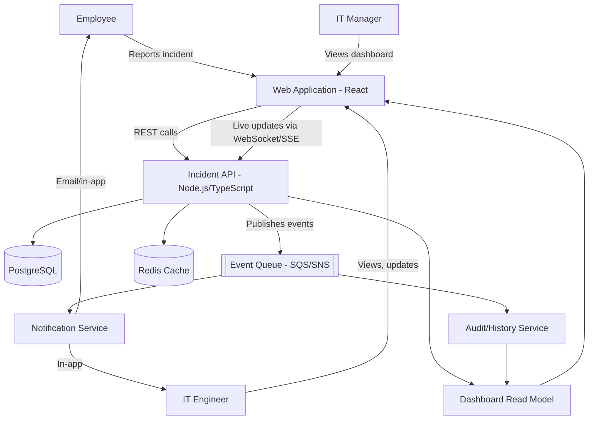
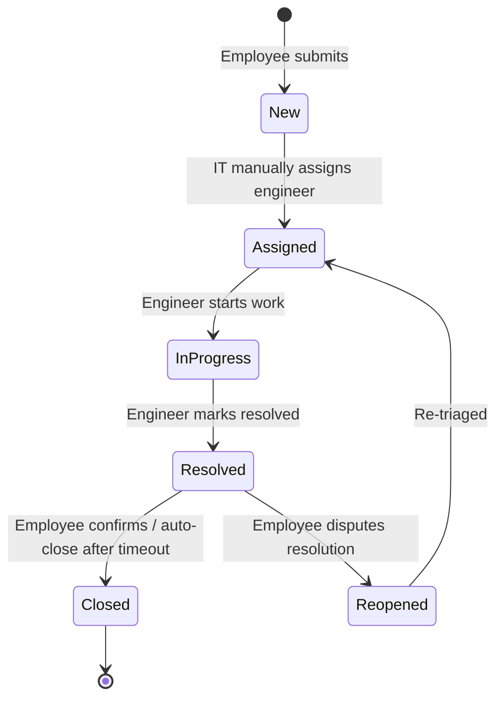
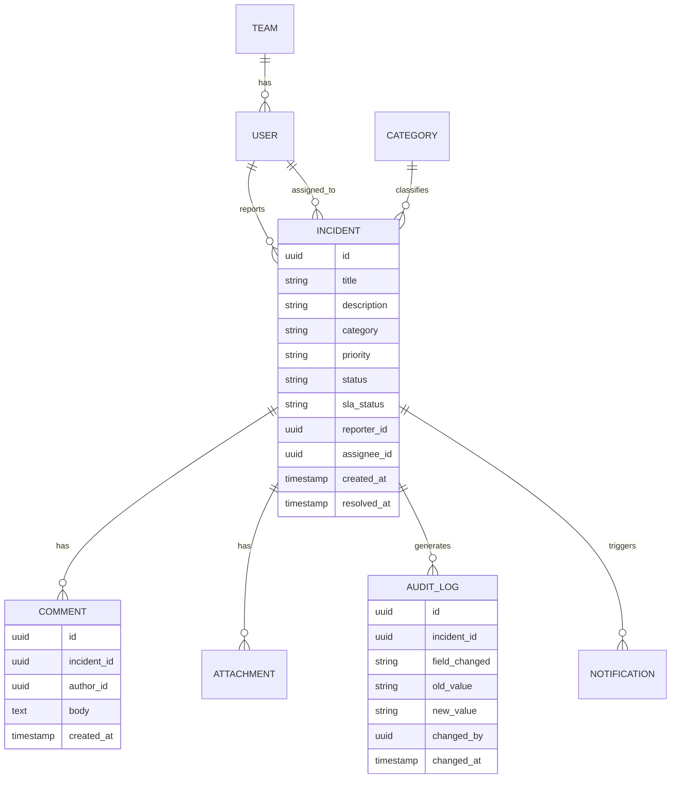
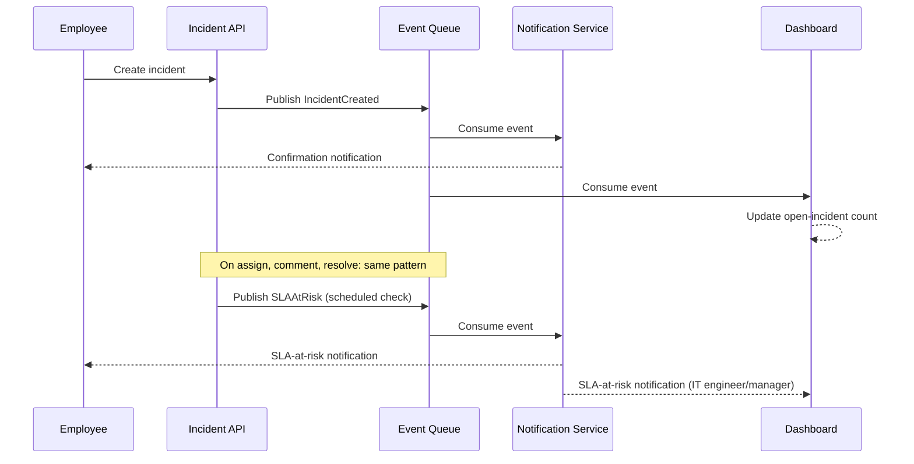
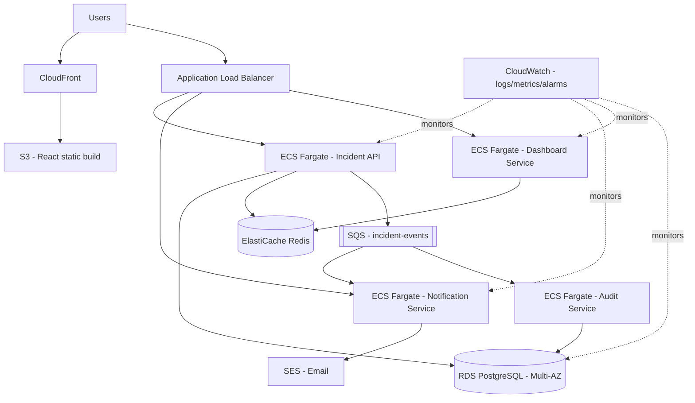

# Employee IT Incident Management Architecture (ICEPOT)

## 1. ICEPOT Decisions

These five answers scope the whole document:

| # | Question | Answer | What it locks in |
| --- | --- | --- | --- |
| Q1 | Submission channel | A — Web app only | No mobile, email, or chat ingestion. One UI surface, one ingestion path. |
| Q2 | Categorization & assignment | A — Employee selects category/priority; IT manually assigns | No auto-classification or auto-routing engine. Simpler backend, more IT triage workload. |
| Q3 | Real-time & SLA behavior | B — Dashboard + notifications | No auto-escalation, no auto-reassignment. SLA breaches are surfaced, not acted on automatically. |
| Q4 | Data & history | D — Full status/assignment history + comments + attachments + audit logs + long-term analytics | Requires an audit/event store and a reporting layer, not just current-state rows. |
| Q5 | Deployment & scale | C — AWS production architecture: API, services, queue/events, cache, DB, notifications, monitoring | Justifies a multi-service AWS design, but stops short of D's HA/auto-scaling emphasis. |

**Net effect:** this is a single-channel, manually-triaged incident system with a production AWS backbone and a strong audit trail — real-time visibility without automated decision-making. The absence of automation (Q2, Q3) keeps the backend simpler than the original brainstorm; the audit/analytics depth (Q4) pushes the data layer beyond simple CRUD.

## 2. System Architecture Overview

The web app is the single point of entry (per Q1). It talks to one Incident API, which is the source of truth. State changes are published as events onto a queue rather than triggering side effects synchronously — this keeps the notification service and audit trail decoupled from the core incident logic, which matters because Q4's audit/analytics requirement means every state transition needs to be captured, not just the current row.

## 3. Component Architecture

| Component | Responsibility | Notes |
| --- | --- | --- |
| **Web Application (React)** | Incident submission form, employee ticket view, IT engineer queue, manager dashboard | Single UI for all roles per Q1; role-based views, not separate apps |
| **Incident API (Node.js/TypeScript)** | CRUD on incidents, comments, attachments, assignment, status transitions | Source of truth; validates state transitions against the lifecycle rules in §4 |
| **Notification Service** | Consumes queue events, sends in-app + email notifications | Triggered on: create, assign, comment, status change, SLA-at-risk (per Q3: notify, don't auto-act) |
| **Audit/History Service** | Appends an immutable event per state change; feeds analytics | Required by Q4 — every transition, not just current state |
| **Dashboard/Read Service** | Pre-aggregated views: open/assigned/at-risk/resolved counts, team workload | Reads from a denormalized read model so the dashboard doesn't hammer the primary DB |
| **Auth Service** | Login, session/JWT issuance, role checks | See §9 |
| **PostgreSQL** | System of record | See §6 for schema |
| **Redis** | Session cache, dashboard read-model cache | Reduces load from repeated dashboard polling |
| **SQS/SNS (event queue)** | Decouples the API from notification + audit side effects | Publish-once, fan-out to two consumers |

## 4. Incident Lifecycle

Since assignment is manual (Q2:A) and there's no auto-escalation (Q3:B), the state machine is intentionally linear with one loop-back (reopen):

Note what's *not* here: there's no automatic transition into an "Escalated" state, because Q3 chose notifications-only. An SLA breach changes a **flag** on the incident (`sla_status: at_risk | breached`) and fires a notification — it does not change the incident's lifecycle state or reassign it. That distinction matters for the API and data model in §5–§6.

## 5. API Endpoints

| Method | Path | Purpose |
| --- | --- | --- |
| POST | `/api/v1/incidents` | Employee creates an incident (self-selected category/priority per Q2:A) |
| GET | `/api/v1/incidents` | List incidents (filterable by status, assignee, category, SLA status) |
| GET | `/api/v1/incidents/{id}` | Get one incident with current state |
| PATCH | `/api/v1/incidents/{id}` | Update fields (title, description, category, priority) |
| POST | `/api/v1/incidents/{id}/assign` | IT manually assigns an engineer |
| POST | `/api/v1/incidents/{id}/comments` | Add a comment |
| POST | `/api/v1/incidents/{id}/attachments` | Upload an attachment |
| POST | `/api/v1/incidents/{id}/resolve` | Mark resolved |
| POST | `/api/v1/incidents/{id}/reopen` | Employee reopens a resolved incident |
| GET | `/api/v1/incidents/{id}/history` | Full audit trail (per Q4:D) |
| GET | `/api/v1/incidents/{id}/sla` | Current SLA status and time remaining |
| GET | `/api/v1/dashboard/summary` | Open/assigned/at-risk/resolved counts |
| GET | `/api/v1/dashboard/workload` | Per-engineer/team workload |
| GET | `/api/v1/dashboard/sla` | SLA breach/at-risk list |
| GET | `/api/v1/reports/*` | Long-term analytics (per Q4:D) — e.g. resolution time trends, category volume |
| GET | `/api/v1/notifications` | List a user's notifications |
| PATCH | `/api/v1/notifications/{id}/read` | Mark read |
| GET | `/api/v1/events/stream` | SSE/WebSocket stream for live dashboard updates |

Notice there's no `POST /incidents/{id}/escalate` or auto-reassign endpoint — Q3:B removed that from scope. If a future iteration adds auto-escalation, this is the endpoint that would be introduced.

## 6. Database Design

The `AUDIT_LOG` table is what makes Q4:D possible: it's an append-only ledger of every field change on every incident, separate from the incident's own current-state row. Analytics/reporting queries run against this table (or a data warehouse fed by it), not against the live `INCIDENT` table, so reporting load never competes with transactional load.

## 7. Notification & Event Flow

Per Q3:B, every one of these events ends at "notify" — none of them triggers an automatic reassignment, priority bump, or state change. An SLA check (a scheduled job, e.g. every few minutes) evaluates open incidents against their category's SLA target and flips `sla_status`, which is itself just data the dashboard reads and the notification service alerts on.

## 8. SLA Design

| Priority | Response SLA | Resolution SLA |
| --- | --- | --- |
| Critical | 15 min | 4 hours |
| High | 1 hour | 8 hours |
| Medium | 4 hours | 2 business days |
| Low | 1 business day | 5 business days |

Since Q2:A puts category/priority selection in the employee's hands (not system-inferred), SLA targets are looked up from a static table keyed by the priority the employee chose. A scheduled job computes `time_remaining` per open incident and sets `sla_status` to `at_risk` (e.g. <20% of SLA window left) or `breached`. Per Q3:B, breach only fires a notification to the assignee and their manager — it does not reassign, re-prioritize, or escalate the incident's owning team.

## 9. Authentication & Authorization

| Role | Can do |
| --- | --- |
| Employee | Create incidents, comment/attach on their own, reopen their resolved incidents, view their own incident history |
| IT Engineer | View assigned queue, update status, comment, resolve |
| IT Manager | View team dashboard/workload, reassign, view SLA reports |
| Admin | Manage categories/teams/users, view all analytics |

Authentication is JWT-based (issued by the Auth Service), with role claims embedded in the token. The API enforces role checks per endpoint (e.g. only IT roles can call `/assign`; only the reporting employee or an IT role can call `/reopen`).

## 10. AWS Deployment Architecture

This matches Q5:C's list directly: API (ALB + Fargate), services (notification, dashboard, audit as separate Fargate services so one doesn't block another), queue/events (SQS), cache (ElastiCache), database (RDS Multi-AZ for durability, not read-replica auto-scaling — that would be Q5:D's territory), notifications (SES), and monitoring (CloudWatch). Each backend concern runs as its own Fargate service behind the same ALB so they scale and fail independently, without going as far as the multi-region/auto-scaling emphasis a "D" answer would have called for.

## 11. Non-Functional Requirements

| Category | Requirement |
| --- | --- |
| Performance | Dashboard loads in <2s; incident creation API responds in <500ms p95 |
| Availability | 99.9% for the API tier (Multi-AZ RDS, 2+ Fargate tasks per service) |
| Scalability | Horizontal scaling of Fargate tasks under load; not designed for multi-region (out of scope per Q5:C vs D) |
| Security | TLS everywhere, JWT auth, role-based access, encrypted RDS/S3 at rest |
| Observability | CloudWatch logs/metrics/alarms on API latency, queue depth, SLA-breach rate |
| Auditability | Every incident field change is immutably logged (Q4:D) |

## 12. Security & Audit Considerations

- **Full audit trail (Q4:D):** every status change, assignment, comment, and attachment is written to `AUDIT_LOG` with who/when/old-value/new-value — supports both compliance review and the analytics reporting in §5.
- **Access control:** role checks at the API layer (§9), not just the UI, so a direct API call can't bypass permissions.
- **Data protection:** attachments and PII (employee names/emails) encrypted at rest (S3 SSE, RDS encryption) and in transit (TLS).
- **Least privilege in AWS:** each ECS service has its own IAM role scoped to only the AWS resources it needs (e.g. the Notification Service can publish to SES but not write to RDS directly).

## 13. Assumptions & Out of Scope

- No mobile app, email-to-ticket, or chat integration (Q1:A ruled these out) — could be added later without changing the core API.
- No AI/ML-based auto-categorization or auto-routing (Q2:A) — the schema still supports adding a `predicted_category` field later without a breaking change.
- No automatic escalation or reassignment on SLA breach (Q3:B) — flagged, not acted on.
- Multi-region failover and auto-scaling policy tuning are out of scope (Q5 stopped at C, not D) — the AWS design in §10 is single-region, Multi-AZ.
